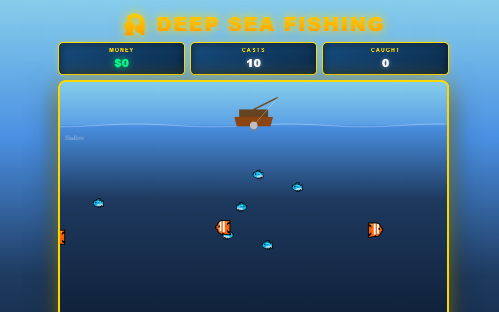
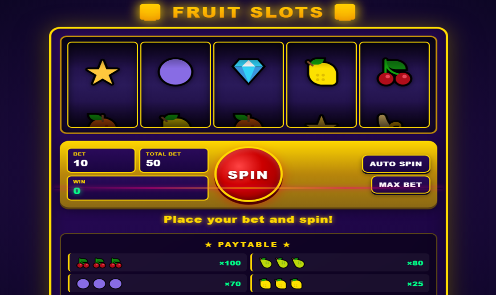
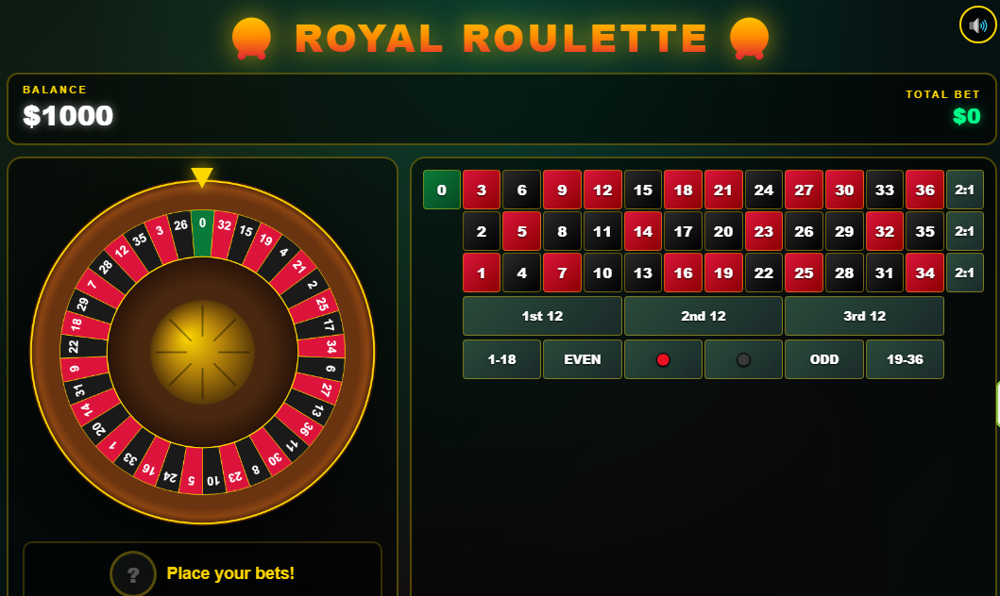
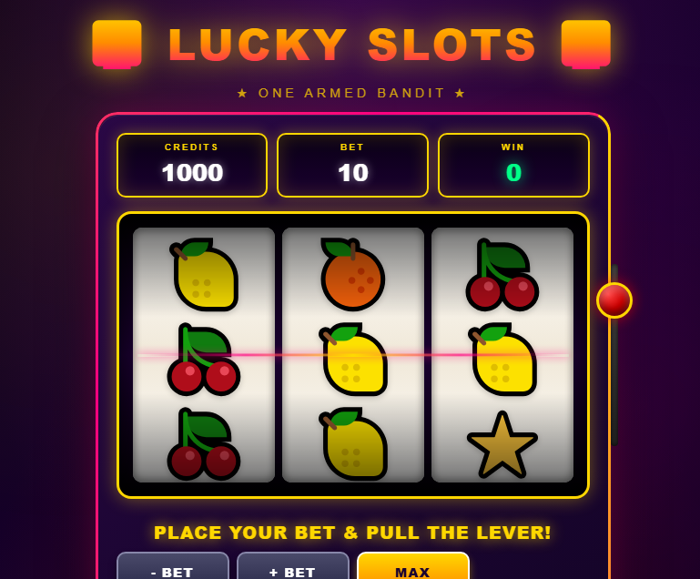

# 🎮 Mini Games

> A collection of lightweight, browser-based mini games built for quick and accessible gameplay on desktop and mobile devices.

[](https://mscbuild.github.io/game/)
[](LICENSE)
[](https://github.com/mscbuild/game/stargazers)

## 🕹️ Play Online

### 👉 [PLAY THE GAMES](https://mscbuild.github.io/game/)

No installation required.

Open the game collection in your browser, choose a game, and start playing.

---

## 📸 Screenshots

### 🎣 Fishing Game



Cast your line, explore the underwater environment, and try to catch as many fish as possible.

### 🍒 Fruit Slots



Place your bet and spin the reels to see which combination appears.

### 🎰 Royal Roulette



Place your bets and spin the roulette wheel.

### 🎰 Lucky Slots



A classic one-armed-bandit style slot experience with colorful fruit symbols.

---

## ✨ Features

- 🎮 Multiple browser-based mini games
- 🌐 Play directly from the web
- 📱 Designed with mobile devices in mind
- 💻 Desktop browser support
- ⚡ Lightweight and fast to load
- 🎨 Custom game interfaces and graphics
- 🧩 Each game is independently accessible
- 📂 Simple, easy-to-understand project structure
- 🔓 Open source under the MIT License

---

## 🕹️ Available Games

| Game | Description | Location |
|---|---|---|
| 🎣 Fishing Game | Cast your line and catch fish | `web/fish.html` |
| 🍒 Fruit Slots | Spin the fruit slot machine | `web/fruit.html` |
| 🎰 Royal Roulette | Classic roulette-style gameplay | `web/rulet.html` |
| 🎰 Lucky Slots | One-armed-bandit style slots | `web/game.html` |
| 🐦 Angry Birds | Physics-inspired arcade gameplay | `web/angry_birds.html` |
| 📖 Bible Quiz | Test your Bible knowledge | `web/bible.html` |
| 🧊 Cube | Fast-paced cube game | External / embedded project |
| 🏎️ Street Racer | Arcade-style racing game | `web/car.html` |
| 🎱 Bubble Shooter | Match and shoot bubbles | `web/bubl.html` |
| *ੈ🎡‧₊˚ Arcade Center 2 | Arcade-style  game | `web/gam.html` |

---

# 🎯 Gameplay

Each game has its own mechanics and controls.

### 🎣 Fishing Game

1. Start the game.
2. Position your fishing activity.
3. Cast your line.
4. Watch for fish.
5. Catch fish and increase your score.
6. Continue playing until you run out of casts or finish the session.

### 🍒 Fruit Slots

1. Choose your bet.
2. Press **SPIN**.
3. Wait for the reels to stop.
4. Match symbols to win.
5. Adjust your bet and play again.

### 🎰 Royal Roulette

1. Choose your desired betting area.
2. Place your bet.
3. Spin the roulette wheel.
4. Wait for the winning number.
5. Check the result.

### 🏎️ Street Racer

1. Start the game.
2. Use the available controls to steer the vehicle.
3. Avoid obstacles.
4. Stay on the track.
5. Try to achieve the highest score possible.

> **Note:** Controls may differ between games. Follow the instructions displayed inside each individual game.

---

# 🧰 Tech Stack

The project is intentionally lightweight and browser-focused.

### Frontend

- **HTML5** — page structure and game interfaces
- **CSS3** — responsive layouts, animations, colors, and visual effects
- **JavaScript** — game logic and interactive behavior
- **Google Fonts** — typography
- **Remix Icon** — interface icons

### Hosting

The project is designed to run as a static website and can be hosted using **GitHub Pages**.

### Architecture

There is no server-side backend required for the core project.

```text
game/
├── index.html
├── LICENSE
├── img/
│   ├── 01.png
│   ├── 02.png
│   ├── 03.png
│   ├── ...
│   └── 10.png
│
└── web/
    ├── angry_birds.html
    ├── bible.html
    ├── bubl.html
    ├── car.html
    ├── fish.html
    ├── fruit.html
    ├── gam.html
    ├── game.html
    └── rulet.html
```

## 📱 Responsive Design

The project is designed to work across different screen sizes.

- Desktop

Enjoy the games using a full-size browser window and keyboard/mouse controls where supported.

- Mobile

Open the project from a mobile browser and interact with games using touch controls where available.

Individual games may have different levels of mobile optimization depending on their implementation.

## 🗺️ Roadmap

The project is actively suitable for further experimentation and expansion.

## ✅ Current
 - Browser-based game collection
 - Game landing page
 - Multiple mini games
 - Game preview images
 - Mobile-oriented layouts
 - GitHub Pages deployment
-  MIT open-source license
## 🚧 Planned
 - Improve consistency between game interfaces
 - Add unified navigation between games
 - Improve accessibility and keyboard support
 - Add persistent high scores
 - Add sound and music settings
 - Improve touch controls
 - Add difficulty levels
 - Add more mini games
 - Add game statistics
 - Improve loading performance
 - Add automated browser testing
 - Improve documentation for individual games
## 💡 Future Ideas
- 🏆 Global leaderboard
- 👤 Player profiles
- ⭐ Achievement system
- 🎖️ Daily challenges
- 🔥 Streak system
- 🌙 Dark/light themes
- 🌍 Internationalization
- 🎵 Custom sound effects
- 📲 Progressive Web App support
- 🤝 Contributing

 ## ⭐ Support the Project

If you enjoy the games or find the project useful:

- ⭐ Star the repository
- 🐛 Report bugs
- 💡 Suggest new ideas
- 🤝 Submit pull requests
- 🎮 Share the games with others

Every contribution helps the project grow.

## 📄 License

This project is licensed under the MIT License.
 
 
